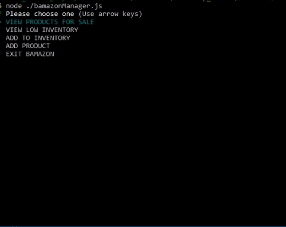
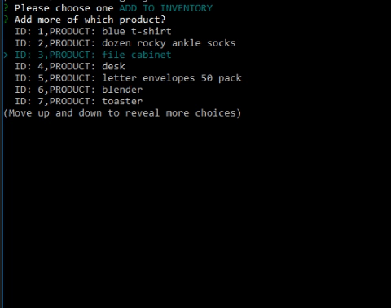
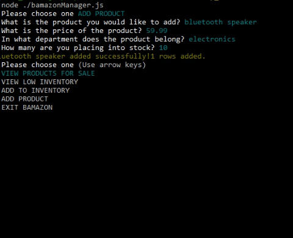

# bamazon

## Description

This terminal based app
bamazon is a command line application which uses nodejs. It is an amazon-like store front. The app leverages MySQL to keep track of purchase orders and inventory and produces reports for would be managers and supervisors of this virtual store.

The `bamazon_db` database consists of two tables, `products` and  `departments`. The ``products table has the following columns:

* item_id (unique id for each product)

* product_name (Name of product)

* dept_id (id of product's department - Note that this field references the `departments` table)

* price (cost to customer)

* stock_quantity (how much of the product is available in stores)

The `departments` table includes the following:

* department_id (unique id for each department)

* department_name (name of the department)

* overhead_costs (cost to install and run department)

## Usage

### `node ./bamazonCustomer.js`

The bamazon customer module will display all of the items available for sale. The id, product names and prices are displayed. The user is then presented with two messages.

1. The first asks for the ID of the product to be purchased.

2. The second message asks how many units of the product the user would like to purchase.

### `node ./bamazonManager.js`

bamazonManager.js. presents a bamazon store manager with a list of menu options:

* View Products for Sale - produces a report that shows item IDs, names, prices, and quantities. The manager can observe the stock quantity available for each product.

* View Low Inventory - this option lists all products with an inventory lower than five.

The image below displays the results of the "VIEW PRODUCTS FOR SALE" and "VIEW LOW INVENTORY" options for the current bamazon_db.

* Add to Inventory - Through this function, the manager can place more stock of the selected item into inventory. In turn, the `products` table is updated.

Below are the prompts displayed to a Manager when adding inventory for the chosen product:

* Add New Product - A manager can add a completely new product to the bamazon database. The manager has to fill out the product name, price, the product's department and an initial stock quantity.

### `node ./bamazonSupervisor.js`

Lists and executes a pair of actions available to store supervisors, "View Product Sales by Department" and "Create Department".

For "View Product Sales by Department", the app produces a sales report, grouped by departments. The total profit generated for each department is listed to the right.

The "Create Department" option allows the supervisor to create the department and specify the overhead cost of the newly added store section.

## Installation

This app can be cloned using git.

However, in order to successfully run this app, a few programs must be already installed as prerequisites.

1. git must be installed.
  [Download git.](https://git-scm.com/downloads)

2. nodejs must also be installed.
  [Download nodejs](https://nodejs.org/en/download/)

3. Now we are ready to clone this app by running the following command. `git clone git@github.com:f-flores/bamazon.git`

4. Since this file makes use of a couple of node modules (`mysql`, `inquirer`, `table` and `colors`) please run `npm install`.  This installs all of the dependencies.

## Comments

The source code for the bamazon app was added to my github page:
[bamazon](https://github.com/f-flores/bamazon)